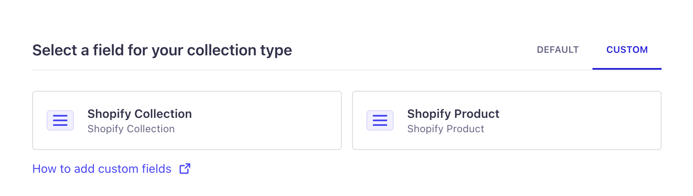
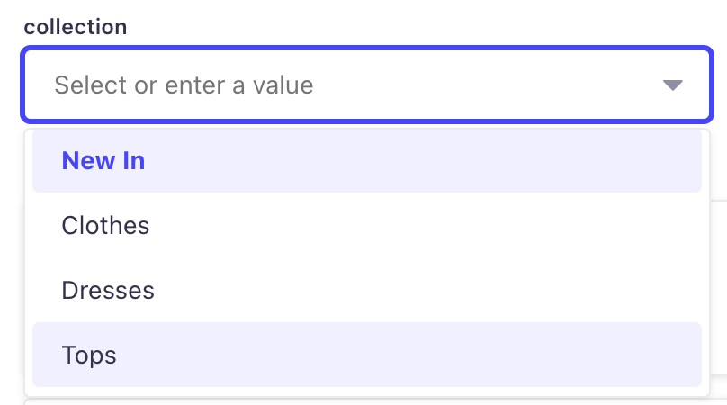
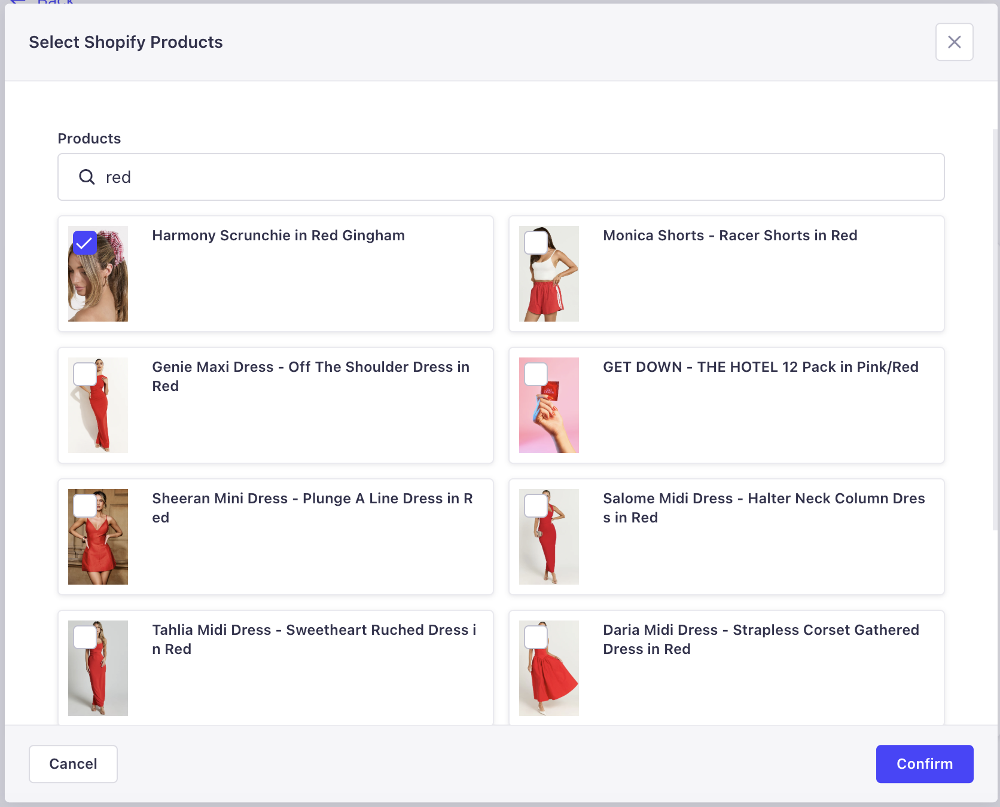

# Shopify Fields Strapi Plugin

A custom Strapi field plugin for adding Shopify collection and product fields to any content type.

## 🚀 Features

- Add Shopify collection field
  - Associate a Strapi content type with a Shopify collection via collection `id`.
- Add Products field
  - Associate mutiple products with any Strapi content.
  - Once queried, the data will include the following properties:
  1. `id`
  2. `handle`
  3. `title`
  4. `imageUrl`

## ✅ Prerequisites

- Strapi v5

## ⚙️ Installation

```shell
npm i shopify-fields-plugin
```

## ⚙️ Configuration

### Shopify Side

1. Open your Shopify admin portal.
2. Create a Shopify App and install it.
3. Under **Configuration**, make sure that the Admin API access scopes include `read_product_listings`, and `read_products` and the Storefront API access scopes has `unauthenticated_read_product_listings`.
4. Under **API credentials** copy the **Storefront API access token**.
5. Note the storefront url as well. It has the format: `your-store.myshopify.com`.

### Strapi App Side

1. Provide the following values inside the `.env` file. Make sure to supply the values you've noted/copied from the previous step.

```
SHOPIFY_SHOP_URL=your-store.myshopify.com
SHOPIFY_STOREFRONT_API_ACCESS_TOKEN=your-storefront-api-access-token
SHOPIFY_API_VERSION=2025-01
```

We need such values since this plugin depends on [@shopify/storefront-api-client](https://www.npmjs.com/package/@shopify/storefront-api-client).

2. Copy then paste the following code inside `config/plugins.ts`:

```ts
export default () => ({
  'shopify-fields-plugin': {
    enabled: true,
    config: {
      shopifyShopUrl: process.env.SHOPIFY_SHOP_URL,
      shopifyApiVersion: process.env.SHOPIFY_API_VERSION,
      shopifyStorefrontApiAccessToken: process.env.SHOPIFY_STOREFRONT_API_ACCESS_TOKEN,
    },
  },
});
```

3. Go to `config/middlewares`, then replace the string `strapi::security` with the following object:

```ts
{
    name: 'strapi::security',
    config: {
      contentSecurityPolicy: {
        directives: {
          'img-src': [
            "'self'",
            'data:',
            'blob:',
            'https://dl.airtable.com',
            'https://cdn.shopify.com',
          ],
        },
      },
    },
  },
```

4. Once done, run your Strapi app using `npm run develop`. When you try to add a field to a new or existing content type, you should be able to see the following fields under **Custom**.



5. The **Shopify Collection** field is a combobox which enables you to select a collection from a Shopify store:



6. The **Shopify Product** field is a Search dialog which enables you to select multiple products from a Shopify store:


